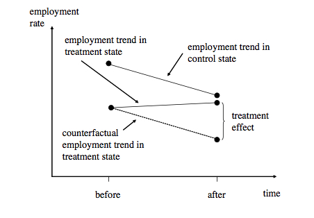
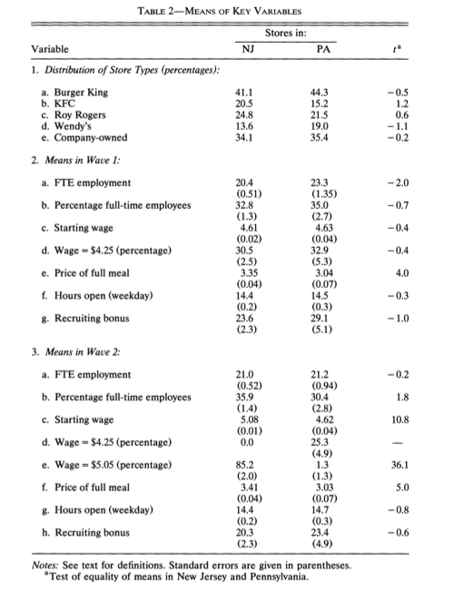
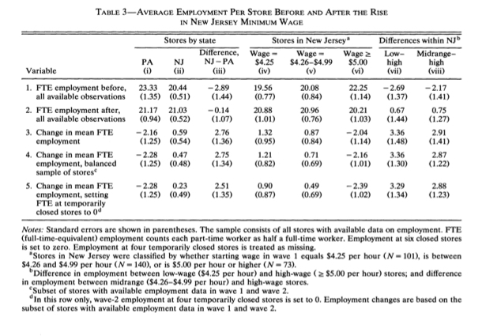
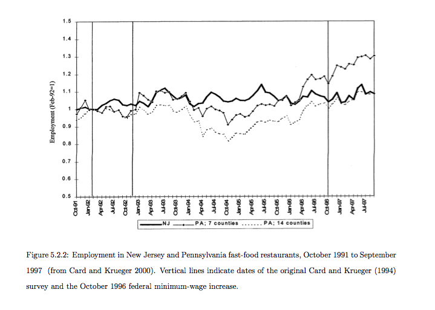

# Difference-in-Differences

Card and Kreuger (1994) study the effects of a minimum wage law change in New Jersey on unemployment. On April 1 1992, New Jersey changed its minimum wage from \$4.25 to \$5.05. They, along with many other policymakers, were interested in whether this rise in the minimum wage would raise unemployment. 

Why would it potentially do this?

What would be the issues with comparing unemployment in towns and cities in New Jersey before the law was implemented and after the law was implemented? 

What would be a field experiment that could be designed in New Jersey to evaluate the impact of the minimum wage? Would it be feasible?

While the minimum wage law was passed in New Jersey, it remained unchanged in Pennsylvania. The formed the basis of a quasi-experiment, whereby unemployment in New Jersey (treatment group) could be compared to unemployment in Pennsylvania (control group) to estimate the impact of the minimum wage on unemployment.

Card and Kreuger survey fast food employers in February 1992 (before law) and November 1992 (after law). 

```{r}

rm(list=ls())

DiD <- matrix(c("A","C","B","D"), ncol=2)
rownames(DiD) <- c("Before Law", "After Law")
colnames(DiD) <- c("New Jersey (Treatment)", "Pennsylvania (Control)")

library(knitr)
kable(DiD)
```

**A** and **C** are the mean levels of unemployment in New Jersey before and after the implementation of the minimum wage law, respectively. **B** and **D** are the mean levels of unemployment in Pennsylvania before and after the implementation of the minimum wage law, respectively.

The difference-in-differences is (**C**-**A**)-(**D**-**B**). In other words, it is the difference in the change in unemployment in New Jersey compared to Pennsylvania. 

If the minimum wage law does indeed raise unemployment, then the change in unemployment in New Jersey should be greater than the change in unemployment in Pennsylvania, and the difference-in-differences estimate should be positive. Or there should be evidence that the minimum wage law increases unemployment. 

Is this identification strategy valid? What does it critically depend on?

The key assumption of this research design, also sometimes called the **nonequivalent group design**, is that Pennsylvania is an appropriate control group for New Jersey. Under what conditions is this plausible or implausible?

The control group, Pennsylvania, must be a counterfactual for the treatment group, New Jersey. It must describe what would have happened in New Jersey if it had not received the minimum wage law. This means that whatever factors change with time in New Jersey must affect Pennsylvania in the same way. 

This is also called the **parallel trends assumption** because the change in unemployment in New Jersey and Pennsylvania must be parallel to one another if New Jersey had not passed the minimum wage law, for the research design to be valid.





Do you believe this a valid research design for evaluating the impact of minimum wage?

# Regression and Difference-in-differences

The difference-in-differences can be expressed as follows:

$$y_{ist} = \alpha + \gamma NJ_{s} + \lambda d_{t} + \beta(NJ_{s} \times d_{t}) + \epsilon_{ist}$$
$y_{ist}$ is unemployment in restaurant $i$ in state $s$ in year $t$. $NJ_{s}$ and $d_{t}$ are dummy variables indicating New Jersey (versus Pennsylvania) and the post-treatment year (versus the pre-treatment year), respectively. There are four parameters in the model.

$$\alpha = E(y_{ist}| s=PA, t=Feb)$$
This is mean unemployment among restaurants in Pennsylvania before the minimum wage law.

$$\gamma = E(y_{ist}| s=NJ, t=Feb) - E(y_{ist}| s=PA, t=Feb)$$
This is the difference in mean unemployment among restaurants in New Jersey bersus Pennsylvania before the minimum wage law.

$$\lambda = E(y_{ist}| s=PA, t=Nov) - E(y_{ist}| s=PA, t=Feb)$$
This is the difference in mean unemployment among restaurants in Pennsylvania before and after the minimum wage law.

$$\beta = \big(E(y_{ist}| s=NJ, t=Nov) - E(y_{ist}| s=NJ, t=Feb)\big) - \big(E(y_{ist}| s=PA, t=Nov) - E(y_{ist}| s=PA, t=Feb)\big)$$
This is the difference in the differences of mean unemployment among restaurants before and after the minimum wage law in New Jersey compared to Pennsylvania. Hence, the name difference-in-differences. $\beta$ is the estimate of the causal effect or more specifically the effect of the treatment on the treated.

Card and Krueger's (1994) analysis can be replicated as follows.

```{r}

rm(list=ls())
library(plyr)

data <- read.csv("public.csv", header=T)
colnames(data)

#Variable construction

data$EMPTOT <- data$EMPPT*0.5 + data$EMPFT + data$NMGRS  #FTE employment, Wave 1
data$EMPTOT2 <- data$EMPPT2*0.5 + data$EMPFT2 + data$NMGRS2 #FTE employment, Wave 2

data$DEMP <- data$EMPTOT2 - data$EMPTOT # Difference in total employment
data$PCHEMPC <- 2*(data$EMPTOT2-data$EMPTOT) / (data$EMPTOT2+data$EMPTOT) # Pct change in employment
data$PCHEMPC[data$EMPTOT2==0] <- -1

data$DWAGE <- data$WAGE_ST2 - data$WAGE_ST # Difference in wage
data$PCHWAGE <- (data$WAGE_ST2 - data$WAGE_ST) / data$WAGE_ST # Pct change in wage

data$GAP <- (5.05-data$WAGE_ST)/(data$WAGE_ST) # Difference between new minimum wage and old wage as a percentage of old wage
data$GAP[data$STATEr==0] <- 0
data$GAP[data$WAGE_ST>=5.05] <- 0

data$NJ <- data$STATEr # New Jersey indicator

data$BK <- 0
data$BK[data$CHAINr==1] <- 1 # Burger King indicator
data$KFC <- 0
data$KFC[data$CHAINr==2] <- 1 # KCF indicator
data$ROYS <- 0
data$ROYS[data$CHAINr==3] <- 1 # Roy Rogers indicator
data$WENDYS <- 0
data$WENDYS[data$CHAINr==4] <- 1 # Wendy's indicator

data$PMEAL <- data$PSODA+data$PFRY+data$PENTREE # Price of meal, Wave 1
data$PMEAL2 <- data$PSODA2+data$PFRY2+data$PENTREE2 # Price of meal, Wave 2
data$DPMEAL <- data$PMEAL2-data$PMEAL # Price of meal, Difference

data$CLOSED <- 0 # Closed indicator
data$CLOSED[data$STATUS2==3] <- 1

data$FRACFT <- (data$EMPFT/data$EMPTOT) # Fraction of full time employment, Wave 1
data$FRACFT2 <- data$EMPFT2/data$EMPTOT2 # Fraction of full time employment, Wave 2

data$ATMIN <- 0  
data$ATMIN[data$WAGE_ST==4.25] <- 1 # At min wage indicator, Wave 1

data$NEWMIN <- 0
data$NEWMIN[data$WAGE_ST2==5.05] <- 1 #At min wave indicator, Wave 2

data$ICODE[data$NJ==0] <- "PA Store"
data$ICODE[data$NJ==1 & data$WAGE_ST==4.25] <- "NJ Store, Low-Wage"
data$ICODE[data$NJ==1 & data$WAGE_ST>=5.00] <- "NJ Store, Hi-Wage"
data$ICODE[data$NJ==1 & data$WAGE_ST>4.25&data$WAGE_ST<5] <- "NJ Store, Med-Wage"
data$ICODE[data$NJ==1 & data$WAGE_ST<4.25] <- "NJ Store, Bad Wage"

```

Similar to the balance checks from last week's discussion of regression discontinuity designs, Card and Krueger (1994) take the time to compare the means of several key variables between New Jersey and Pennsylvania, in Wave 1 and Wave 2. This is displayed in Table 2.



```{r}

a1 <- mean(na.omit(data$BK[data$NJ==1]))
a2 <- mean(na.omit(data$BK[data$NJ==0]))

b1 <- mean(na.omit(data$KFC[data$NJ==1]))
b2 <- mean(na.omit(data$KFC[data$NJ==0]))

c1 <- mean(na.omit(data$ROYS[data$NJ==1]))
c2 <- mean(na.omit(data$ROYS[data$NJ==0]))

d1 <- mean(na.omit(data$WENDYS[data$NJ==1]))
d2 <- mean(na.omit(data$WENDYS[data$NJ==0]))

e1 <- mean(na.omit(data$CO_OWNED[data$NJ==1]))
e2 <- mean(na.omit(data$CO_OWNED[data$NJ==0]))

t1 <- summary(lm(BK ~ NJ, data=data))$coefficients[6]
t2 <- summary(lm(KFC ~ NJ, data=data))$coefficients[6]
t3 <- summary(lm(ROYS ~ NJ, data=data))$coefficients[6]
t4 <- summary(lm(WENDYS ~ NJ, data=data))$coefficients[6]
t5 <- summary(lm(CO_OWNED ~ NJ, data=data))$coefficients[6]


Tab21 <- matrix(c(a1, a2, b1, b2, c1, c2, d1, d2, e1, e2), byrow=T, nrow=5)
Tab21 <- cbind(Tab21, c(t1, t2, t3, t4, t5))
colnames(Tab21) <- c("NJ", "PA", "t")
rownames(Tab21) <- c("Burger King", "KFC", "Roy Rogers", "Wendy's", "Company-Owned")
kable(Tab21, caption="Table 2.1: Distribution of Store Types (percentages)")
```

Table 2.1 is meant to show that the stores in their sample have similar average food prices, store hours, and employment levels. 

```{r}

a1 <- mean(na.omit(data$EMPTOT[data$NJ==1]))
a2 <- mean(na.omit(data$EMPTOT[data$NJ==0]))

b1 <- mean(na.omit(data$FRACFT[data$NJ==1]))
b2 <- mean(na.omit(data$FRACFT[data$NJ==0]))

c1 <- mean(na.omit(data$WAGE_ST[data$NJ==1]))
c2 <- mean(na.omit(data$WAGE_ST[data$NJ==0]))

d1 <- mean(na.omit(data$ATMIN[data$NJ==1]))
d2 <- mean(na.omit(data$ATMIN[data$NJ==0]))

e1 <- mean(na.omit(data$PMEAL[data$NJ==1]))
e2 <- mean(na.omit(data$PMEAL[data$NJ==0]))

f1 <- mean(na.omit(data$HRSOPEN[data$NJ==1]))
f2 <- mean(na.omit(data$HRSOPEN[data$NJ==0]))

g1 <- mean(na.omit(data$BONUS[data$NJ==1]))
g2 <- mean(na.omit(data$BONUS[data$NJ==0]))

t1 <- summary(lm(EMPTOT ~ NJ, data=data))$coefficients[6]
t2 <- summary(lm(FRACFT ~ NJ, data=data))$coefficients[6]
t3 <- summary(lm(WAGE_ST ~ NJ, data=data))$coefficients[6]
t4 <- summary(lm(ATMIN ~ NJ, data=data))$coefficients[6]
t5 <- summary(lm(PMEAL ~ NJ, data=data))$coefficients[6]
t6 <- summary(lm(HRSOPEN ~ NJ, data=data))$coefficients[6]
t7 <- summary(lm(BONUS ~ NJ, data=data))$coefficients[6]

Tab22 <- matrix(c(a1, a2, b1, b2, c1, c2, d1, d2, e1, e2, f1, f2, g1, g2), byrow=T, nrow=7)
Tab22 <- cbind(Tab22, c(t1, t2, t3, t4, t5, t6, t7))
colnames(Tab22) <- c("NJ", "PA", "t")
rownames(Tab22) <- c("FTE employment", "Percentage full-time employees", "Starting wage", "Wage=$4.25 (percentage)", "Price of full meal", "Hours open (weekday)", "Recruiting bonus")
kable(Tab22, caption="Table 2.2: Means in Wave 1")
```

Table 2.2 shows that average employment was similar per store in New Jersey compared to Pennsylvania. Starting wages were also similar, and there were no significant cross-state differences in average hours of operation, the fraction of full-time workers, and the prevalance of bonus programs to recruit new workers, although the average price of a full meal (medium soda, small fries, and entree) were significantly higher in New Jersey.


```{r}


a1 <- mean(na.omit(data$EMPTOT2[data$NJ==1]))
a2 <- mean(na.omit(data$EMPTOT2[data$NJ==0]))

b1 <- mean(na.omit(data$FRACFT2[data$NJ==1]))
b2 <- mean(na.omit(data$FRACFT2[data$NJ==0]))

c1 <- mean(na.omit(data$WAGE_ST2[data$NJ==1]))
c2 <- mean(na.omit(data$WAGE_ST2[data$NJ==0]))

d1 <- mean(na.omit(data$NEWMIN[data$NJ==1]))
d2 <- mean(na.omit(data$NEWMIN[data$NJ==0]))

e1 <- mean(na.omit(data$PMEAL2[data$NJ==1]))
e2 <- mean(na.omit(data$PMEAL2[data$NJ==0]))

f1 <- mean(na.omit(data$HRSOPEN2[data$NJ==1]))
f2 <- mean(na.omit(data$HRSOPEN2[data$NJ==0]))

g1 <- mean(na.omit(data$SPECIAL2[data$NJ==1]))
g2 <- mean(na.omit(data$SPECIAL2[data$NJ==0]))

t1 <- summary(lm(EMPTOT2 ~ NJ, data=data))$coefficients[6]
t2 <- summary(lm(FRACFT2 ~ NJ, data=data))$coefficients[6]
t3 <- summary(lm(WAGE_ST2 ~ NJ, data=data))$coefficients[6]
t4 <- summary(lm(NEWMIN ~ NJ, data=data))$coefficients[6]
t5 <- summary(lm(PMEAL2 ~ NJ, data=data))$coefficients[6]
t6 <- summary(lm(HRSOPEN2 ~ NJ, data=data))$coefficients[6]
t7 <- summary(lm(SPECIAL2 ~ NJ, data=data))$coefficients[6]

Tab22 <- matrix(c(a1, a2, b1, b2, c1, c2, d1, d2, e1, e2, f1, f2, g1, g2), byrow=T, nrow=7)
Tab22 <- cbind(Tab22, c(t1, t2, t3, t4, t5, t6, t7))
colnames(Tab22) <- c("NJ", "PA", "t")
rownames(Tab22) <- c("FTE employment", "Percentage full-time employees", "Starting wage", "Wage=$4.25 (percentage)", "Price of full meal", "Hours open (weekday)", "Recruiting bonus")
kable(Tab22, caption="Table 2.3: Means in Wave 2")

```

Table 2.3 shows that the average starting wage in New Jersey increased by 10 percent following the rise of the minimum wage. By wave 2, virtually all restaurants in New Jersey that had been paying less than $5.05 per hour reported a starting wage equal to the new rate. Only two other variables showed a relative change between waves, the fraction of full-time employees and the price of a meal. 

The authors also find that stores with missing data on employment, wages, and prices are similar in other respects to stores with complete data.

These checks are meant to show that fast food restaurants in Pennsylvania, just across the Delaware River, are an appropriate control group for fast food restaurants in New Jersey.

The difference-in-differences estimator is implemented below.

```{r}
EMPTOTFULL <- c(data$EMPTOT, data$EMPTOT2)
NJFULL <- c(data$NJ, data$NJ)
WAVE2FULL <- c(rep(0,410), rep(1, 410))

DDdata <- as.data.frame(cbind(EMPTOTFULL, NJFULL, WAVE2FULL))

DDdata[1:15,]

```


```{r}

PA1 <- mean(na.omit(DDdata[NJFULL==0 & WAVE2FULL==0,][,1]))
NJ1 <- mean(na.omit(DDdata[NJFULL==1 & WAVE2FULL==0,][,1]))
Diff1 <- NJ1 - PA1


PA2 <- mean(na.omit(DDdata[NJFULL==0 & WAVE2FULL==1,][,1]))
NJ2 <- mean(na.omit(DDdata[NJFULL==1 & WAVE2FULL==1,][,1]))
Diff2 <-NJ2 - PA2

DiffPA <- mean(na.omit(DDdata[NJFULL==0 & WAVE2FULL==1,][,1])) - mean(na.omit(DDdata[NJFULL==0 & WAVE2FULL==0,][,1]))
DiffNJ <- mean(na.omit(DDdata[NJFULL==1 & WAVE2FULL==1,][,1])) - mean(na.omit(DDdata[NJFULL==1 & WAVE2FULL==0,][,1]))
Diff3 <- DiffNJ - DiffPA

Tab3A <- rbind(cbind(PA1, NJ1, Diff1), cbind(PA2, NJ2, Diff2), cbind(DiffPA, DiffNJ, Diff3))
colnames(Tab3A) <- c("PA", "NJ", "Difference, NJ-PA")
kable(Tab3A)
```

Alternatively, we can obtain these estimates using linear regression.

```{r}
M0DiD <- lm(EMPTOTFULL ~ NJFULL + WAVE2FULL + NJFULL*WAVE2FULL, data=DDdata)

summary(M0DiD)

PA1 <- M0DiD$coefficients[1]
NJ1 <- M0DiD$coefficients[1]+M0DiD$coefficients[2]
Diff1 <- NJ1 - PA1

PA2 <- M0DiD$coefficients[1]+M0DiD$coefficients[3]
NJ2 <- M0DiD$coefficients[1]+M0DiD$coefficients[2]+M0DiD$coefficients[3]+M0DiD$coefficients[4]
Diff2 <- NJ2 - PA2

PA3 <- (M0DiD$coefficients[1]+M0DiD$coefficients[3])-M0DiD$coefficients[1]
NJ3 <- (M0DiD$coefficients[1]+M0DiD$coefficients[2]+M0DiD$coefficients[3]+M0DiD$coefficients[4])-(M0DiD$coefficients[1]+M0DiD$coefficients[2])
Diff3 <- Diff2 - Diff1

Tab3B <- rbind(cbind(PA1, NJ1, Diff1), cbind(PA2, NJ2, Diff2), cbind(DiffPA, DiffNJ, Diff3))
rownames(Tab3B) <- NULL
colnames(Tab3B) <- c("PA", "NJ", "Difference, NJ-PA")
kable(Tab3B)
```

The results show that the change in employment in New Jersey was actually larger than the change in employment in Pennsylvania. However, the estimates are statistically insignificant, and Card and Krueger conclude that there is no evidence of an employment decline after the minimum wage increase.

# Difference-in-differences and Fixed Effects

Difference-in-differences estimation is a version of fixed effects estimation that uses aggregate data. Fixed effects regressions require panel data or repeated measurements on the same unit over time. Often, however, the regressor of interest varies only at an aggregated level. 

In the Card and Kreuger example, the minimum wage changes occurs at the the state level, although employment is observed at the restaurant level. Restaurants are nested within states, with the treatment occuring at the state level.

This can be distinguished from a country-year panel data analysis, where the regressor of interest, say institutional quality, varies by country, and the outcome of interest, say economic growth, varies by country also.

When there are more than two units and time periods, the model can be generalized as follows from Card (1992):

$$y_{ist} = \gamma_{s} + \lambda_{t} + \beta (FA_{s} \times d_{t}) + \epsilon_{ist} $$
$$y_{ist} = \gamma_{s} + \lambda_{t} + \beta_{1}FA_{s} + \beta_{2}d_{t} + \beta_{3}(FA_{s} \times d_{t}) + \epsilon_{ist} $$

$\gamma_{s}$ are state dummies, $\lambda_{t}$ are time dummies, and $(FA_{s} \times d_{t})$ is an interaction term that multiplies the fraction of teenagers likely to be affected by a minimum wage increase in each state, and a dummy for observations after 1990, when the federal minimum wage increased from \$3.35 to \$3.80. $y_{ist}$ means that employment varies by the individual across states over time.

$\beta_{1}$ is therefore the change in employment that is associated on average with a marginal increase in the fraction of teenagers likely to be affected by a minimum wage, holding constant the increase of the minimum wage.

$\beta_{2}$ is the change in employment that is associated on average with an increase in the minimum wage, holding constant the effect of an increase in the fraction of teengers likely to be affected by the law.

The estimate, $\beta_{3}$, is therefore the difference in the differences of employment that is associated on average with a marginal increase in the fraction of teenagers likely to be affected by the minimum wage increase, before and after the minimum wage increase.

This regression equation can be expanded to include both state-level and individual-level covariates.

$$y_{ist} = \gamma_{s} + \lambda_{t} + \beta_{1}FA_{s} + \beta_{2}d_{t} + \beta_{3}(FA_{s} \times d_{t}) + \Psi X_{ist} + \Phi W_{st} + \epsilon_{ist} $$

Going back to the Card and Kreuger example, it turns out that Pennsylvania may not be an appropriate control group for New Jersey. Why?



# Fixed Effects vs. Random Effects

Fixed effects are sometimes contrasted with "random effects". Both are widely used in models of variable intercepts in panel data analysis. 

We are familiar with fixed effects, $\alpha_{i}$, which we defined as a unit-specific intercept. In this case, we do not have a model for intercept itself. Instead, we control for everything that is captured by these time-invariant unobservables by including them as a covariate in the model (dummy variables), estimating their effect, and holding them constant.

Alternatively, we can attempt to model these unit-specific effects. In a simple way, we can make some distributional assumptions about them. We can assume they come from some common population with an unknown variance that we estimate.

This distinction can be expressed as follows:

$$\alpha_{i} = \alpha^{*}_{i}$$
as a fixed effect, where the $\alpha^{*}_{i}$ is the estimated sample mean of unit $i$ of the outcome variable of interest.

$$\alpha_{i} \sim N(0, \sigma^{2}_{\alpha})$$
as a random effect, where the unit-specific effects are distributed normally with mean 0 and variance $\sigma^{2}$.

Unlike with fixed-effects, estimation of these random effects focuses on this variance, and not on particular $\alpha_{i}$. This is done via MLE.

The random-effects assume that $\alpha_{i}$ is uncorrelated with the regressors by design. Unlike fixed-effects, these unit-specific intercepts are determined after we obtain the overall regression slope, and they cannot change the slope.

Because the omitted variable in a random-effects model is uncorrelated with included regressors by design there is no bias from ignoring it - in effect, it becomes part of the residual. 

But this is problematic if the assumption fails, and we do have reason to believe that these unit-specific effects are correlated with the regressors. Using random effects in this scenario produces biased estimates. Fixed effects are often justified on this basis to control for these unit-specific effects.


